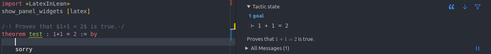

# LatexInLean

This package adds a widget that renders Latex in doc modules into the Lean infoview.

## Installation

1. Add the following line to the end of your `lakefile.lean`:
   ```
   require LatexInLean from git "https://github.com/kcaze/LatexInLean.git"@"main"
   ```
2. Run the `lake update` in the root directory of your Lean project.

## Usage

To use LatexInLean in a `.lean` file, you need to add two lines:

1. Add `import LatexInLean` to the beginning of your file to import the LatexInLean package.
2. Add `show_panel_widgets [latex]` immediately after your import statements to activate the LatexInLean widget in the Lean infoview.

Once LatexInLean is activated, you can document your `theorem`'s, `lemma`'s, `example`'s, etc. with module docstrings that contain Latex within `$`'s. A module docstring is a special type of comment that begins with the syntax `/-!` and ends with `-/`.

## Example

Here is an example of how you might document your code to use LatexInLean.


